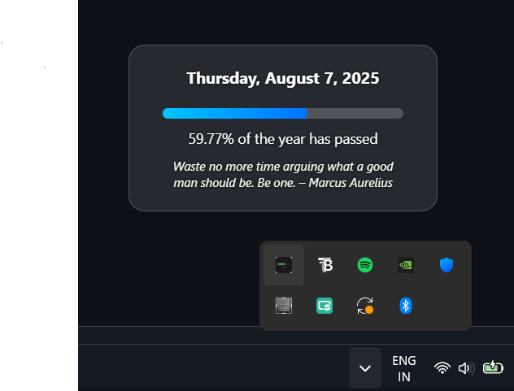

# 📅 Year Progress Widget

A sleek, glass-style desktop tray widget built with **Electron.js** that shows you how much of the current year has passed — right from your system tray.



## ✨ Features

- 🕒 **Live Year Progress Bar**  
- 📌 **Sits in the system tray** for easy access  
- 💎 **Glass-like UI** with CSS backdrop blur  
- 🧠 **Minimal distraction** — click to view, click away to hide  
- 🛠️ Built with **Electron.js**

## 🚀 Installation

> 🪟 Windows only (for now)

1. Download the latest `.exe` from [Releases](https://github.com/kanishk-16/Year-Progress-Widget/releases)
2. Run it — it’ll sit in your tray with a custom icon
3. Click the tray icon to view the year progress

---

## 📷 Screenshot

> *Glass-style floating widget when clicked from the tray:*


---

## 🛠 Tech Stack

- [Electron.js](https://www.electronjs.org/)
- HTML, CSS (with blur effect)
- Node.js

---

## 📦 Packaging

```bash
npm install
npx electron-builder --windows
```
